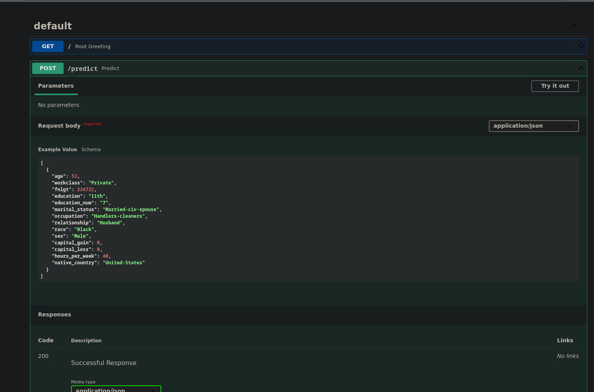
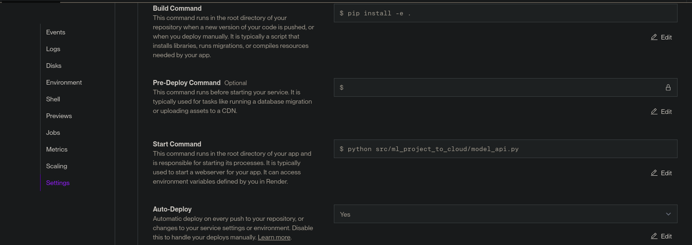
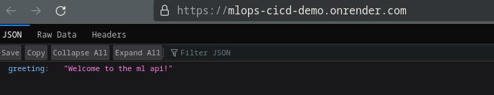
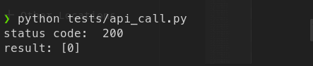

.. These are examples of badges you might want to add to your README:
   please update the URLs accordingly

    .. image:: https://api.cirrus-ci.com/github/<USER>/ml-project-to-cloud.svg?branch=main
        :alt: Built Status
        :target: https://cirrus-ci.com/github/<USER>/ml-project-to-cloud
    .. image:: https://readthedocs.org/projects/ml-project-to-cloud/badge/?version=latest
        :alt: ReadTheDocs
        :target: https://ml-project-to-cloud.readthedocs.io/en/stable/
    .. image:: https://img.shields.io/coveralls/github/<USER>/ml-project-to-cloud/main.svg
        :alt: Coveralls
        :target: https://coveralls.io/r/<USER>/ml-project-to-cloud
    .. image:: https://img.shields.io/pypi/v/ml-project-to-cloud.svg
        :alt: PyPI-Server
        :target: https://pypi.org/project/ml-project-to-cloud/
    .. image:: https://img.shields.io/conda/vn/conda-forge/ml-project-to-cloud.svg
        :alt: Conda-Forge
        :target: https://anaconda.org/conda-forge/ml-project-to-cloud
    .. image:: https://pepy.tech/badge/ml-project-to-cloud/month
        :alt: Monthly Downloads
        :target: https://pepy.tech/project/ml-project-to-cloud
    .. image:: https://img.shields.io/twitter/url/http/shields.io.svg?style=social&label=Twitter
        :alt: Twitter
        :target: https://twitter.com/ml-project-to-cloud

.. image:: https://img.shields.io/badge/-PyScaffold-005CA0?logo=pyscaffold
    :alt: Project generated with PyScaffold
    :target: https://pyscaffold.org/

|

===================
ml-project-to-cloud
===================

    Project for the udacity course. Link is: https://github.com/jarneamerlinck/mlops-cicd-demo

Required images
===============

All images under `docs/_static`

|Api_docs|

|continuous_deloyment|

|live_get|

|live_post|

.. _pyscaffold-notes:

Note
====

This project has been set up using PyScaffold 4.5. For details and usage
information on PyScaffold see https://pyscaffold.org/.
